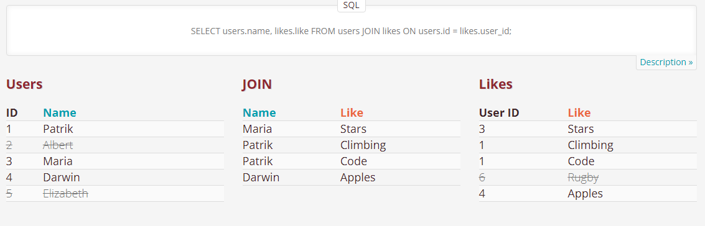
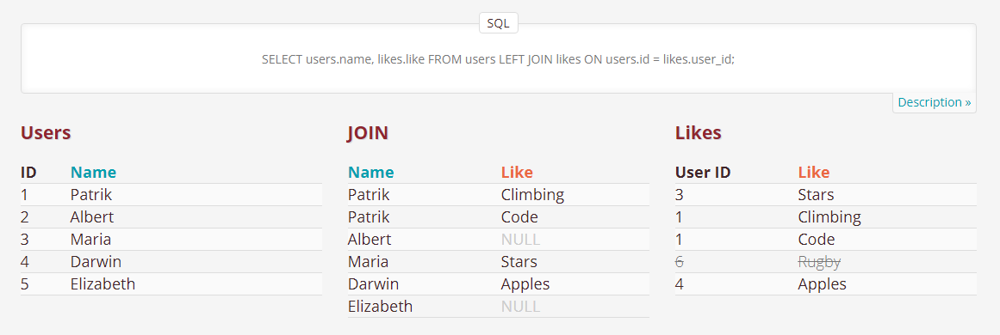
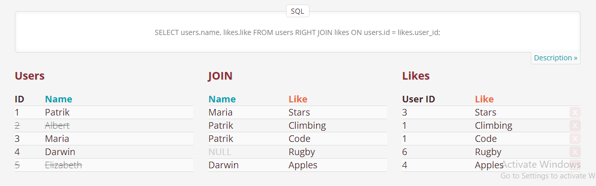
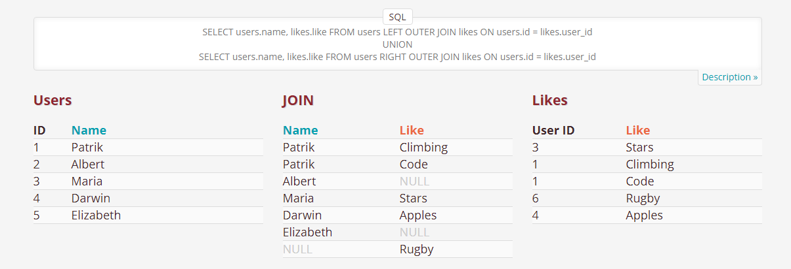

## MySQL Basics

### Section 01 : [ SHOW | CREATE | DROP ] : Database


| Command    | Description |
| ----------- | ----------- |
|**SHOW DATABASES**  ;   | List all databases on the sql server.      |
|**CREATE DATABASE** db_name ;  |  To create a new database.|
|**DROP DATABASE** db_name ; | To delete the whole database | 
|**BACKUP DATABASE**; |Ask Sir !!!!! | 

<br>

### Section 02 : [ CREATE | RENAME | DROP  ] : Table

| Command    | Description |
| ----------- | ----------- |
|**CREATE TABLE** table_name ( <br>  column_name_1 data_type (size) NULL/ NOT NULL , <br> column_name_2 data_type (size) NULL/ NOT NULL ,<br> column_name_3 data_type (size) NULL/ NOT NULL , <br>........................................<br>........................................<br> PRIMARY KEY(column_name/s) ,<br> CONSTRAINT fk_name FOREIGN KEY (Column_Name/s) REFERENCES referenced_table_name(referenced_column_Name/s) ON DELETE CASCADE ON UPDATE CASCADE , <br> .......................... ); |  To Create a Table with Primary key and Foreign Keys .<br> <br><b>NOTE : Each Table can have only one Primary Key which may consists of one or more than one Columns . But a table/relation may have multiple Foreign Key .In Case of , Foreign Key Declaration , referenced Column have to be Primary Key in Referenced Table/Relation.|
|**RENAME TABLE** old_table_name TO new_table_name; | To rename the existing Table. |
|**DROP TABLE** table_name; | To drop the table. | 
|**DELETE** FROM table_name <br>WHERE condition;|Used to delete existing Rows in a table when condition meets.|

<br>
  

### Section 03 : [ INSERT INTO ] : Table
  
| Command    | Description |
| ----------- | ----------- |  
|INSERT INTO table_name VALUES (value1,value2,value3,......) , (value1,value2,value3,......) , (value1,value2,value3,......), ..... ; | TO add values for all the columns of the table, do not need to specify the column names in the SQL query. However, make sure the order of the values is in the same order as the columns in the table.|
|INSERT INTO table_name (column1, column2, column3, ...) VALUES (value1,value2,value3,......) , (value1,value2,value3,......) , (value1,value2,value3,......), ..... ; |TO insert Data Only in Specified Columns.|
  <br>

  <br> 

  ### Section 10 : [ ALTER TABLE ] : column
  
| Command    | Description |
| ----------- | ----------- |
|**ALTER TABLE** | Used to **add, delete, or modify columns** and  **add and drop various constraint**.|
|**ALTER TABLE** table_name <br>**ADD** column_name datatype;| Add new column in Table.|
|**ALTER TABLE** table_name<br>**DROP COLUMN** column_name;| Delete exsisting column.  |
|**ALTER TABLE** table_name<br>**DROP COLUMNS** column_name1 , column_name2 , ... ;| Delete exsisting columns.  |
|**ALTER TABLE** table_name<br>**MODIFY COLUMN** column_name new_datatype;|Change the data type of a column in a table.<br>**NOTE :** Be careful About previous datatype and values.|
|**ALTER TABLE** table_name<br>**CHANGE** old_column_name new_column_name new_datatype;|Change old column name and datatype. <br> **NOTE :** Again be careful about previous datatype and values .It may truncate previous data in case of smaller size of datatype. |

<br> 
<br>
  

### Section 04 : [ SELECT ] : Table


| Command    | Description |
| ----------- | ----------- |
|SELECT column1, column2, ...<br> FROM table_name ;| Used to select data from a database.The data returned is stored in a result table, called the result-set.|
|SELECT * FROM table_name |To see all the fields available in the table|
|SELECT <b>DISTINCT</b> column1, column2, ... FROM table_name; | Used to return only distinct (different) values. <br> <b>NOTE : Inside a table, a column often contains many duplicate values; and sometimes you only want to list the different (distinct) values.</b>|
|SELECT * FROM table_name <b>LIMIT</b> row_number <br><br> SELECT * FROM table_name <b>LIMIT</b> starting_row_number ending_row_number | Useful on large tables with thousands of records. Returning a large number of records can impact performance. Used to see specific number of Records |
  
 <br><br>

 ### Section 06: [ WHERE ] : Table
  
| Command    | Description |
| ----------- | ----------- |  
|SELECT column1, column2, ... FROM table_name <b>WHERE</b> condition ; | Used to filter records. It is used to extract only those records that fulfill a specified condition. It is also used in <b> UPDATE , DELETE</b> , etc.! |
  
  <br><br>

  ### Section 11 : [ AS ] : column
  
| Command    | Description |
| ----------- | ----------- |
| **AS**  | Used to <b> rename a column or table </b> with an  <b> alias (উপনাম) </b> . <br> An alias only exists for the duration of the query.|
| SELECT <b> CustomerName AS Customer</b>,<b> ContactName AS 'Contact Person'</b> <br> FROM Customers;| Renaming Column with single word or Multiple Words|
|SELECT o.OrderID, o.OrderDate, c.CustomerName<br>FROM <b>Customers AS c, Orders AS o</b><br>WHERE ....... ;|Renaming Table|
|SELECT S_Id as 'Student ID' , S_Name as 'Student Name' , <br> <b> CONCAT_WS(' ',S_Address,S_Email,S_Mobile) as 'Contact Details' </b> <br> from student  ;| Combining Column   |
<br> 
<br>
  

### Section 05: [ ORDER BY ] : Table
  
| Command    | Description |
| ----------- | ----------- |
|SELECT column1, column2, ...FROM table_name <b> ORDER BY</b> column1, column2,... ASC/DESC; | Used to sort the result-set in ascending or descending order. It sorts the records in ascending order by default. To sort the records in descending order, use the DESC keyword. <br> <b> NOTE : ORDER BY Several Columns : In case of Ordering By several Columns , It sorts based on First column, if it founds duplicate of then it follows second column and so on ... </b>|

<br>
  


  

### Section 07: [ Operators ] : Table
  
  #### [ Arithmatic Operator ]
  
  | Command    | Description |
  | ----------- | ----------- |
  |+| Addition |
  |-|Subtraction|
  |*|Multiplication|
  |/|Division|
  |%|Modulo|
  
 
  #### [ Comparison Operator ]
  | Command    | Description |
  | ----------- | ----------- |
  | = | Equal |
  | > | Greater than |
  | < | Less than	|
  | >= | Greater than or equal	|
  |<= |	Less than or equal |  
  |<>|	Not equal.<br><b> Note: In some versions of SQL this operator may be written as !=	</b>|
  
  
  
  #### [ Logical Operator ]
  | Command    | Description |
  | ----------- | ----------- |
  |SELECT column1, column2, ...<br>FROM table_name<br>WHERE condition1 <b>AND</b> condition2 <b>AND</b> condition3 ...;| The AND operator displays a record if <b>All</b> the conditions separated by AND are TRUE.|
  |SELECT column1, column2, ...<br>FROM table_name<br>WHERE condition1 <b>OR</b> condition2 <b>OR</b> condition3 ...;| The AND operator displays a record if <b>ANY</b> of the condition separated by OR is TRUE.|
  |SELECT column1, column2, ...<br>FROM table_name<br>WHERE <b>NOT</b> condition;| The NOT operator displays a record if the condition(s) is NOT TRUE.|
  |SELECT column_name(s) <br>FROM table_name <br> WHERE column_name <b>IN</b> (value1, value2, ...);|The IN operator allows you to specify multiple values in a WHERE clause.The IN operator is a <b> shorthand for multiple OR conditions.</b>|
  |SELECT column_name(s) <br>FROM table_name <br>WHERE column_name <br> <b>BETWEEN</b> value1 AND value2;|	Between a certain range of value1 and value2  |
  |SELECT column_name(s) <br>FROM table_name <br>WHERE column_name <br> <b> NOT BETWEEN</b> value1 AND value2;| All of the value out of the range value1 and value2 |
  | SELECT column1, column2, ...<br>FROM table_name<br> WHERE columnN <b>LIKE</b> pattern;|" a% " =	Strings start with a <br> " %a " = Strings end with a<br>" %or% "=	Strings that have or in any position<br> " _ r % "	= strings that have "r" in the 2nd position from Beginning <br> "a _ %"	= Strings start with a and It at least have 1 char after a . <br> "a _ _ %" = Strings start with a and It at least have 2 char after a . <br>"a%o" =	Strings that start with "a" and ends with "o" <br> [ _ _ _ ] matches any string of exactly three characters.<br>[ _ _ _ %] matches any string of at least three characters.<br><br> If a pattern has <b> "n" number of Underscore</b> at the beginning, It will not count n number of character from beginging in the String.<br><br>If a pattern has <b> "n" number of Underscore</b> at the end, string must have at least n number of charcter after the pattern in String | 
  |Logical Operator Used in SubQuery : All-ANY-EXISTS-SOME| We will Study them In the later part of the File|
  
 
  
 
  
  
  <br>
  <br>

  
<br>
<br>

### Section 08 : [ JOIN - CARTESIAN PRODUCT ] : Row 


In different cases , we need to join two or more tables.To join two or more tables , we apply Cartesian Product formula here.But Cartesian Product returns all possible result .So also need to apply condition basis of Primary Key/Others Key of those table.

**Syntex :** 
```
SELECT * FROM tablename_1 , tablename_2 , ..... where condition/s.
```
Given Command Shows all column from those table . To get specific colum use ```tablename_1.column_name``` instead of * . We can re-write the command using **JOIN-ON** keyword.

**Syntex :** 

```
SELECT * FROM tablename_1 JOIN tablename_2 JOIN ..... ON condition/s.
```

**Classification of Join :** 

Here we are using two table given below to understand join in MySQL . 
<br>

#### INNER JOIN or JOIN : 




**Syntex :**
```
SELECT column_name(s)
FROM table1
INNER JOIN table2
ON table1.column_name = table2.column_name;

```
<br>

#### LEFT OUTER JOIN : 




**Syntex :**
```
SELECT column_name(s)
FROM table1
LEFT JOIN table2
ON table1.column_name = table2.column_name;

```
<br>

#### RIGHT OUTER JOIN : 




**Syntex :**
```
SELECT column_name(s)
FROM table1
RIGHT JOIN table2
ON table1.column_name = table2.column_name;

```
<br>

#### FULL OUTER JOIN : 




**Syntex :**
```
SELECT column_name(s) FROM table1 LEFT JOIN table2  ON table1.column_name = table2.column_name;
UNION
SELECT column_name(s) FROM table1 RIGHT JOIN table2  ON table1.column_name = table2.column_name;

```

<br>
<br>


| Command    | Description |
| ----------- | ----------- |
|  **INNER JOIN**<br> SELECT column_name(s)<br>FROM table1<br>INNER JOIN table2<br>ON table1.column_name = table2.column_name;|Returns records that have matching values in both tables |
| **LEFT (OUTER) JOIN** <br> SELECT column_name(s)<br>FROM table1<br>LEFT JOIN table2<br>ON table1.column_name = table2.column_name;|Returns all records from the left table, and the matched records from the right table|
| **RIGHT (OUTER) JOIN** <br>SELECT column_name(s)<br>FROM table1<br>RIGHT JOIN table2<br>ON table1.column_name = table2.column_name;| Returns all records from the right table, and the matched records from the left table|
| **FULL (OUTER) JOIN** <br> SELECT column_name(s) FROM table1 <br> LEFT JOIN table2  ON table1.column_name = table2.column_name;<br>UNION<br>SELECT column_name(s) FROM table1<br> RIGHT JOIN table2  ON table1.column_name = table2.column_name;|FULL (OUTER) JOIN: Returns all records when there is a match in either left or right table|
|**SELF JOIN** <br>  **SELECT** column_name(s)<br>**FROM** table1 T1, table1 T2<br>**WHERE** condition;|A self join is a regular join, but the table is joined with itself.**T1 and T2 are different table aliases for the same table.**|

<br><br>


  

### Section 09 : [ UPDATE - TRUNCATE TABLE ] : Row 
  
| Command    | Description |
| ----------- | ----------- |
|**UPDATE** table_name <br> SET column1 = value1, column2 = value2, ...<br>WHERE condition;|Used to modify the existing records in a table.|
|**TRUNCATE TABLE** table_name;| Deletes the data inside a table, but not the table itself.|

<br> 
<br>


### Section 12: [ Aggregate Functions - Group Functions ] : Table-Column
  
| Command    | Description |
| ----------- | ----------- |
|<b>Aggregate Functions :</b> | They also known as **Group Functions**.Because they operate on sets of rows and generate a result. |
|**AVG()** <br> SELECT AVG(column_name) AS 'Average Value' From table_name ; |Return the average value for the given column.|
|**COUNT()** <br>SELECT COUNT(column_name) AS 'COUNTER'from table_name ;| Returns the number of records returned by a select query.<br>**Note:** NULL values are not counted.|
|**MIN()** <br>SELECT MIN(column_name) AS 'Minimum' from table_name ;| Returns the minimum data from the records.|
|**MAX()** <br>SELECT MAX(column_name) AS 'Maximum' from table_name ;| Returns the maximum data from the records.|
|**SUM()** <br>SELECT SUM(column_name) AS 'Sum' from table_name |returns the total sum of a numeric column|

<br> 
<br>

### Section 13: [ GROUP BY ] : Table-Column

| Command    | Description |
| ----------- | ----------- |
|**GROUP BY**|<br>Make group of rows that have the same values into summary rows, like **"find the number of customers in each country"**.It is often used with aggregate functions **(COUNT(), MAX(), MIN(), SUM(), AVG())** to group the result-set by one or more columns.<br>|
|**SELECT** column_name(s) , aggrergate function  <br>**FROM** table_name <br> **WHERE** condition <br> **GROUP BY** column_name(s) <br> **ORDER BY** column_name(s); |EXAMPLE : TABLE- demo<br>SELECT country , sum(age) AS AGE_SUM <br> from  customer_informationlistforsale <br>GROUP BY (country) <br>ORDER BY AGE_SUM ;|


<br> 
<br>

### Section 14 : [ Functions ] : Table-Column-Row
  
| Command    | Description |
| ----------- | ----------- |
|**UPPER()** <br> SELECT UPPER (column_name ) as New_name <br> From table_name <br><br> SELECT UPPER('string');|Convert the character case. New_name must Be assigned using AS , else It shows Heading with Upper Keyword . |
|**lOWER()** SELECT LOWER (column_name ) as New_name <br> From table_name <br><br> SELECT LOWER('string');|Convert the character case.|
|**CONCAT()** <br> <br>SELECT CONCAT(column_name1, " ",column_name2, " ",column_name," ",....) AS new_name <br>FROM table_name; <br><br>SELECT CONCAT (exp1," ",exp2," ",....) <br> |Adds two or more expressions/columns together.|
|**CONCAT_WS()** <br> SELECT CONCAT_WS(" ",column_name1,column_name2,column_name,....) AS new_name <br>FROM table_name; <br><br>SELECT CONCAT_WS (" ",exp1,exp2,....) <br> |Do as **CONCAT()** . Only difference , you don't have to put individual space after each string.Put separator at the beginning.  |
|**POW()**<br> SELECT POW(value1,value2) | Return value1 is Powered By value2 |
|**GREATEST()** <br> GREATEST(arg1, arg2, arg3, ...)| Returns the greatest one from arg list.|
|**LEAST()** <br> LEAST(arg1, arg2, arg3, ...)| Returns the smallest one from arg list.|
|**LOG()** <br> Selcet LOG(value) ; <br>Selcet LOG2(value) ; <br>Selcet LOG10(value) ; <br> | LOG(value) - Returns natural Logarithms <br> LOG2(value) - Returns 2-based Logarithms <br> LOG10(value) - Returns Common Logarithm |
|**RAND()** - SELECT RAND()  | Generate random value.|
|<b> More Mathematical Functions : </b><br> **TRUNCATE** - TRUNCATE(number, decimals) <br>**ROUND** - ROUND(number, decimals) <br>**FLOOR** - FLOOR(value)  <br> **CEIL** - CEIL(value)  <br>**ABS** - ABS(value) <br>**SQRT** - SQRT(value) <br> **EXP** - EXP(value) <br>**PI** - PI() <br> **DEGREES** - DEGREES(radians_value) <br> **RADIANS** - RADIANS(degrees_value)| **Truncate()** truncates a number to the specified number of decimal places.<br>Example : TRUNCATE(2.343454,4); = 2.3434 <br><br> **ROUND()** DO same as TRUNCATE().Only Difference is, one can omit decimal value in this Function and in this case it returns decimal portion of Given number <br> Use ROUND rather TRUNCATE <br><br>**Floor()** function returns the largest integer value that is smaller than or equal to a number.<br><br> **CEIL()** function returns the smallest integer value that is bigger than or equal to a number. <br><br>**ABS()** returns Absolute value of given value.<br><br>**SQRT()** function returns the square root of a number.<br><br> **EXP()** - Return e raised to the power of given number. <br><br> **PI()** - Return the value of PI <br><br> **DEGREES()** function converts a value in radians to degrees. <br><br>**RADIANS()** function converts a degree value into radians.|
|<b>Trigonometric Functions : </b>*<br> SELECT **SIN(value)**; <br> SELECT **ASIN(value)**; <br> SELECT **COS(value)**; <br> SELECT **ACOS(value)**; <br> SELECT **TAN(value)**; <br> SELECT **ATAN(value)**; <br> |**SIN(value)**- Returns Sine of given number<br> **ASIN(value)**- Returns ARC Sine of given number<br>**COS(value)**- Returns CoSine of given number<br>**ACOS(value)**- Returns ARC COSine of given number<br>**TAN(value)**- Returns Tangent of given number<br>**ATAN(value)**- Returns ARC Tangent of given number<br>|
<br> 
<br>


### Section 15 : [ Constraints ] : Table-Column
  
| Command    | Description |
| ----------- | ----------- |
|NOT NULL | Ensures that a column cannot have a NULL value |
|UNIQUE | Ensures that all values in a column are different|
|PRIMARY KEY | A combination of a NOT NULL and UNIQUE. Uniquely identifies each row in a table|
|FOREIGN KEY  |Prevents actions that would destroy links between tables|
|<b>CHECK</b> | The CHECK constraint is used to limit the value range that can be placed in a column.<br>If you define a CHECK constraint on a column it will allow only certain values for this column.<br>If you define a CHECK constraint on a table it can limit the values in certain columns based on values in other columns in the row.<br>https://www.w3schools.com/sql/sql_check.asp |
|<b>DEFAULT</b> <br>1] <br> CREATE TABLE Persons (<br>    City varchar(255) <b>DEFAULT 'Sandnes'</b><br>);<br><br>  2] <br>ALTER TABLE Persons <br>ALTER City<b> SET DEFAULT 'Sandnes'</b>;<br> <br> 3]<br> ALTER TABLE Persons <br> ALTER City <b> DROP DEFAULT;</b> <br>|Sets a default value for a column if no value is specified <br> 1] SQL DEFAULT on CREATE TABLE <br>2] SQL DEFAULT on ALTER TABLE  <br> 3] DROP a DEFAULT Constraint <br> |
|CREATE INDEX | Used to create and retrieve data from the database very quickly|


