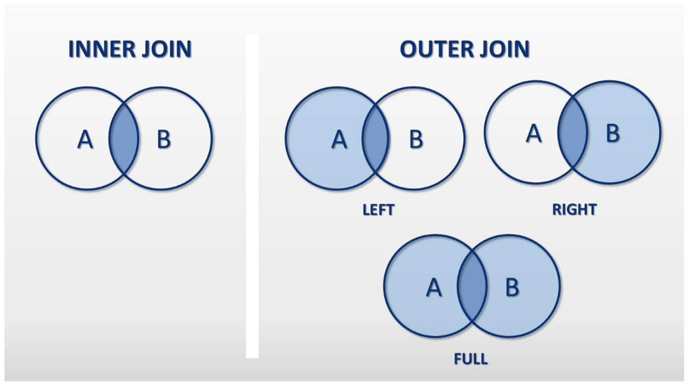

<br>
<br>

#### Section 08 : [ JOIN - CARTESIAN PRODUCT ] : Row 


In different cases , we need to join two or more tables.To join two or more tables , we apply Cartesian Product formula here.But Cartesian Product returns all possible result .So also need to apply condition basis of Primary Key/Others Key of those table.

**Syntex :** 
```
SELECT * FROM tablename_1 , tablename_2 , ..... where condition/s.
```
Given Command Shows all column from those table . To get specific colum use ```tablename_1.column_name``` instead of * . We can re-write the command using **JOIN-ON** keyword.

**Syntex :** 

```
SELECT * FROM tablename_1 JOIN tablename_2 JOIN ..... ON condition/s.
```

**Classification of Join :** 
  
 


| Command    | Description |
| ----------- | ----------- |
|  **INNER JOIN** <table><thead><tr><th>Command</th><th>Description</th></tr></thead><tbody><tr><td>Sajjad</td><td>Hossain</td></tr></tbody></table>| Returns records that have matching values in both tables |
| **OUTER JOIN** |Returns records that have matching values in both tables|